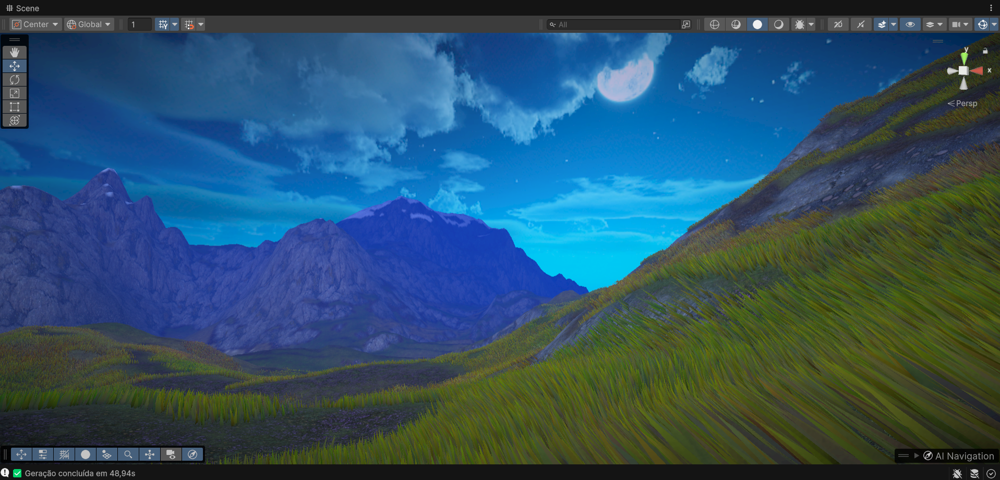

# AAA Terrain Grass Generator for Unity

Um gerador de grama procedural para Unity focado em alto desempenho e grande apelo visual, inspirado nas técnicas de jogos AAA como *Ghost of Tsushima*, *Breath of the Wild* e *Horizon Zero Dawn*.

Este sistema não usa o sistema de `Detail` do terreno da Unity. Em vez disso, ele gera *meshes* (malhas) otimizadas em "chunks" (pedaços), permitindo controle total sobre a aparência e comportamento da grama, incluindo animações de vento e interação com o jogador.

## ✨ Principais Características

* **Geração Híbrida:** Combina texturas do terreno (splatmaps) com ruído Perlin para um posicionamento natural e orgânico.
* **Alto Desempenho:** Utiliza *mesh chunking* e Culling (Distância, Frustum e LOD) para renderizar milhões de lâminas de grama com FPS estável.
* **Grama Interativa:** A grama reage e se curva quando um Transform (como o jogador) se move através dela.
* **Animação de Vento Avançada:** Simulação de vento global com direção, velocidade, força e turbulência, enviada para o shader.
* **Tipos de Lâminas Múltiplos:** Crie e misture diferentes tipos de grama (comum, alta, trevos) com distribuição baseada em ruído.
* **Editor Customizado:** Um inspetor limpo e fácil de usar para configurar todos os aspectos do gerador.

## 🚀 Como Usar

### 1. Instalação

1.  Baixe os dois scripts:
    * `TerrainGrassGenerator.cs`
    * `TerrainGrassGeneratorEditor.cs`
2.  Crie uma pasta chamada `Editor` na raiz do seu projeto `Assets` (se ainda não existir).
3.  Coloque o script `TerrainGrassGenerator.cs` em qualquer pasta (ex: `Assets/Scripts`).
4.  **Importante:** Coloque o script `TerrainGrassGeneratorEditor.cs` dentro da pasta `Assets/Editor`.

### 2. Configuração na Cena

1.  Tenha um objeto `Terrain` na sua cena com texturas já pintadas.
2.  Adicione o componente `TerrainGrassGenerator` a este objeto `Terrain`.
3.  Você verá o inspetor customizado aparecer.

### 3. Requisitos do Shader (Importante!)

Este script **não é um shader**. Ele é um gerador de *malha* (mesh). Ele precisa de um **Material** que use um shader customizado, capaz de receber os dados que ele envia para a GPU.

O seu shader (seja URP, HDRP ou Built-in) **precisa** suportar:

* **Vertex Colors (`Color`):** Usado para tudo!
    * `Color.rgb`: Variação de cor e cor base da textura do terreno.
    * `Color.a`: A altura normalizada da lâmina (0 na base, 1 na ponta). Essencial para gradientes de cor e para a animação de vento/interação.
* **Animação de Vento:**
    * `_WindParams (Vector4)`: Contém (DireçãoX, Turbulência, DireçãoZ, Tempo).
    * `_WindStrength (Float)`: A força geral do vento.
* **Interação:**
    * `_InteractionPos (Vector4)`: Posição (x, y, z) do jogador. O `.w` é usado para a força.
    * `_InteractionRadius (Float)`: O raio de interação.

Sem um shader que leia essas propriedades, a grama parecerá estática e sem cor.

## 🛠️ Configuração no Inspetor

O inspetor customizado organiza todas as configurações:

### 🗺️ Geração por Terreno e Ruído

* **Grass Layers:** A lista principal. Adicione as camadas de textura do seu terreno (pelo índice) e marque `Permitir Grama` se aquela textura deve ter grama.
* **Minimum Texture Weight:** O quão "forte" a textura precisa estar pintada no terreno para que a grama apareça.
* **Perlin Noise Scale:** Controla o tamanho das "manchas" de ruído usadas para quebrar a uniformidade.
* **Minimum Noise Acceptable Value:** O limiar do ruído. Valores mais altos criam mais falhas, tornando a grama mais esparsa.

### 📐 Densidade e Posicionamento

* **Chunk Size:** O tamanho (em metros) de cada "pedaço" de malha. Valores menores = mais chunks, melhor culling, mas maior *draw call*. (64 é um bom padrão).
* **Grass Density:** O número de lâminas por metro quadrado.
* **Leaf Dispersion:** O quão longe do "ponto raiz" as lâminas podem se espalhar (cria tufos).

### 🌿 Tipos de Lâminas

Aqui você define os "prefabs" da sua grama.

* **Lista de Tipos:** Crie quantos tipos quiser.
    * **Forma:** Tamanho (largura/altura) e Segmentos (quantas "dobras" a lâmina tem).
    * **Aparência:** Gradiente de cor da base até a ponta.
    * **Variação:** Variações aleatórias de cor (matiz, saturação), escala e inclinação.
    * **Controle de Ruído:** A faixa de ruído (0-1) onde este tipo aparece.
* **Presets Rápidos:** Adiciona tipos pré-configurados (Grama Comum, Alta, Trevo).
* **Controle de Distribuição:** Configura como os tipos são misturados, usando a barra de "Distribuição dos Tipos".

### ✂️ Culling e LOD

Configurações cruciais de performance.

* **Max Render Distance:** Distância máxima (em metros) da câmera para renderizar a grama.
* **LOD Distances:** Distâncias para os níveis de detalhe (LOD 0, 1, 2).
* **Cull Percentage:** O quão pequeno na tela um chunk precisa ser para ser "culled" (removido).

### 💨 Animação de Vento

* **Enable Wind:** Liga/desliga o vento global.
* **Speed, Strength, Direction, Turbulence:** Controla a aparência do vento.

### 🎮 Grama Interativa

* **Enable Interaction:** Liga/desliga a interação.
* **Player Transform:** **Arraste o Transform do seu jogador aqui.**
* **Interaction Radius/Strength:** Controla o raio e a força da interação.

### ⚡ Otimização Avançada

* **Max Vertices Per Chunk:** Limite de segurança. Se um chunk atingir este número, ele para de adicionar grama.
* **Use Ambient Occlusion:** Um "AO Falso" que escurece a base da grama (via vertex color).
* **Randomize Rotation:** Rotação Y aleatória para evitar padrões.
* **Height Variation:** Usa ruído para variar a altura da grama.

### 🎨 Material

* **Grass Material:** O campo mais importante. **Arraste aqui o seu Material customizado** que usa o shader de grama.

## 📄 Licença

Este projeto é distribuído sob a Licença MIT. Veja o arquivo `LICENSE` para mais detalhes.

## 🙏 Agradecimentos

* A inspiração para este projeto veio das apresentações da GDC sobre os sistemas de vegetação de *Ghost of Tsushima* (Sony Sucker Punch) e *Horizon Zero Dawn* (Guerrilla Games).
